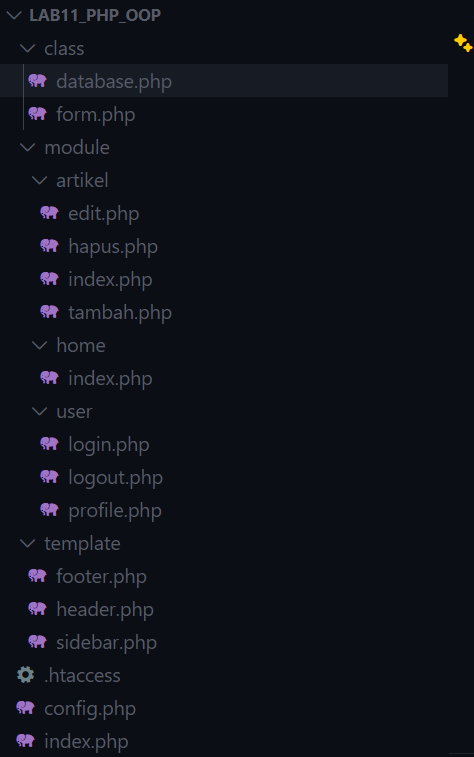
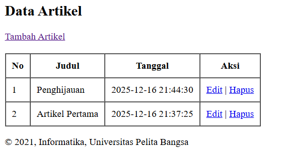
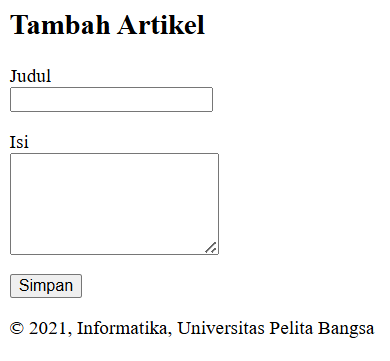
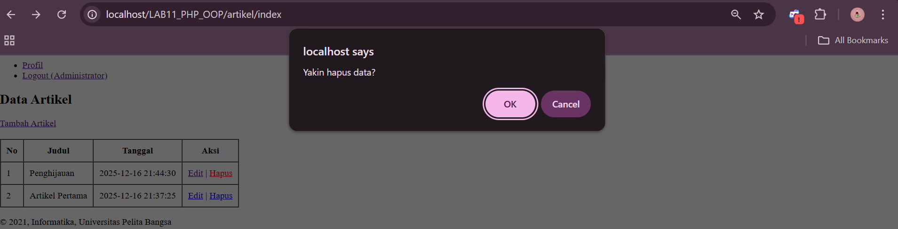
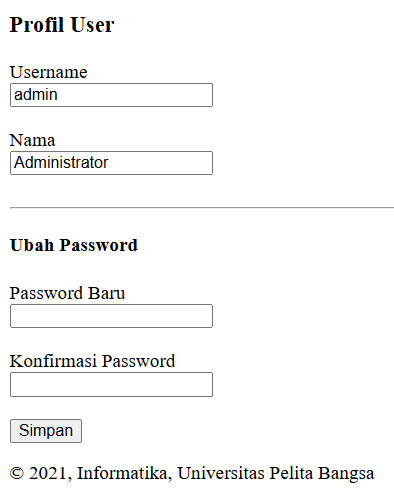
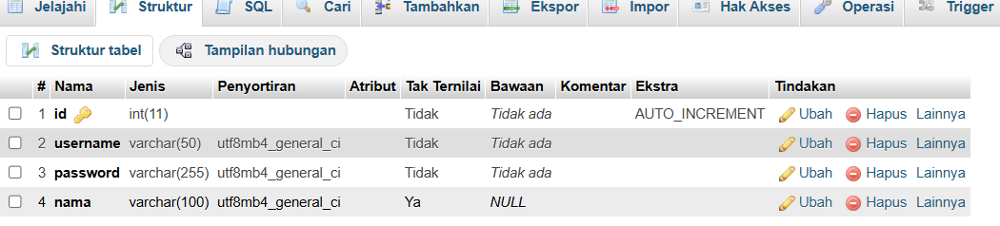
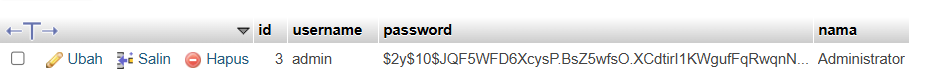

# lab11web_lanjutan
```
Nama  : M. Rizqy Al Rasyd
Nim   : 312410424
Kelas : TI.24.A3
```
## Struktur

## Database.php
```
<?php
class Database
{
    protected $host;
    protected $user;
    protected $password;
    protected $db_name;
    protected $conn;

    public function __construct()
    {
        $this->getConfig();
        $this->conn = new mysqli($this->host, $this->user, $this->password, $this->db_name);
        if ($this->conn->connect_error) {
            die("Connection failed: " . $this->conn->connect_error);
        }
    }

    private function getConfig()
    {
        include("config.php");
        $this->host = $config['host'];
        $this->user = $config['username'];
        $this->password = $config['password'];
        $this->db_name = $config['db_name'];
    }

    public function query($sql)
    {
        return $this->conn->query($sql);
    }

    public function get($table, $where = null)
    {
        if ($where) {
            $where = " WHERE " . $where;
        }
        $sql = "SELECT * FROM " . $table . $where;
        $sql = $this->conn->query($sql);
        $sql = $sql->fetch_assoc();
        return $sql;
    }

    public function insert($table, $data)
    {
        if (is_array($data)) {
            foreach ($data as $key => $val) {
                $column[] = $key;
                $value[] = "'{$val}'";
            }
            $columns = implode(",", $column);
            $values = implode(",", $value);
        }

        $sql = "INSERT INTO " . $table . " (" . $columns . ") VALUES (" . $values . ")";
        $sql = $this->conn->query($sql);

        if ($sql == true) {
            return $sql;
        } else {
            return false;
        }
    }

    public function update($table, $data, $where)
    {
        $update_value = [];
        if (is_array($data)) {
            foreach ($data as $key => $val) {
                $update_value[] = "$key='{$val}'";
            }
            $update_value = implode(",", $update_value);
        }

        $sql = "UPDATE " . $table . " SET " . $update_value . " WHERE " . $where;
        $sql = $this->conn->query($sql);

        if ($sql == true) {
            return true;
        } else {
            return false;
        }
    }
}
?>
```
## Form.php
```
<?php
/**
* Nama Class: Form
* Deskripsi: Class untuk membuat form inputan dinamis (Text, Textarea, Select, Radio, Checkbox)
*/
class Form
{
    private $fields = array();
    private $action;
    private $submit = "Submit Form";
    private $jumField = 0;

    public function __construct($action, $submit)
    {
        $this->action = $action;
        $this->submit = $submit;
    }

    public function displayForm()
    {
        echo "<form action='" . $this->action . "' method='POST'>";
        echo '<table width="100%" border="0">';

        foreach ($this->fields as $field) {
            echo "<tr><td align='right' valign='top'>" . $field['label'] . "</td>";
            echo "<td>";

            switch ($field['type']) {
                case 'textarea':
                    echo "<textarea name='" . $field['name'] . "' cols='30' rows='4'></textarea>";
                    break;

                case 'select':
                    echo "<select name='" . $field['name'] . "'>";
                    foreach ($field['options'] as $value => $label) {
                        echo "<option value='" . $value . "'>" . $label . "</option>";
                    }
                    echo "</select>";
                    break;

                case 'radio':
                    foreach ($field['options'] as $value => $label) {
                        echo "<label><input type='radio' name='" . $field['name'] . "' value='" . $value . "'> " . $label . "</label> ";
                    }
                    break;

                case 'checkbox':
                    foreach ($field['options'] as $value => $label) {
                        echo "<label><input type='checkbox' name='" . $field['name'] . "[]' value='" . $value . "'> " . $label . "</label> ";
                    }
                    break;

                case 'password':
                    echo "<input type='password' name='" . $field['name'] . "'>";
                    break;

                default:
                    echo "<input type='text' name='" . $field['name'] . "'>";
                    break;
            }

            echo "</td></tr>";
        }

        echo "<tr><td colspan='2'>";
        echo "<input type='submit' value='" . $this->submit . "'></td></tr>";
        echo "</table>";
        echo "</form>";
    }

    public function addField($name, $label, $type = "text", $options = array())
    {
        $this->fields[$this->jumField]['name'] = $name;
        $this->fields[$this->jumField]['label'] = $label;
        $this->fields[$this->jumField]['type'] = $type;
        $this->fields[$this->jumField]['options'] = $options;
        $this->jumField++;
    }
}
?>
```
## Config.php
```
<?php
$config = [
    'host'     => 'localhost',
    'username' => 'root',
    'password' => '',
    'db_name'  => 'latihan_oop'
];
```
## .htaccess
```
<IfModule mod_rewrite.c>
    RewriteEngine On
    RewriteBase /lab11_php_oop/
    RewriteCond %{REQUEST_FILENAME} !-d
    RewriteCond %{REQUEST_FILENAME} !-f
    RewriteRule ^(.*)$ index.php/$1 [L]
</IfModule>
```
## modul/artikel/index.php
```
<?php
$db = new Database();
$data = $db->query("SELECT * FROM artikel ORDER BY id DESC");
?>

<h2>Data Artikel</h2>
<a href="../artikel/tambah" class="btn btn-primary">Tambah Artikel</a>
<br><br>

<table border="1" cellpadding="10" cellspacing="0">
    <tr>
        <th>No</th>
        <th>Judul</th>
        <th>Tanggal</th>
        <th>Aksi</th>
    </tr>

    <?php $no = 1; while ($row = $data->fetch_assoc()): ?>
    <tr>
        <td><?= $no++ ?></td>
        <td><?= $row['judul'] ?></td>
        <td><?= $row['created_at'] ?></td>
        <td>
            <a href="../artikel/edit?id=<?= $row['id'] ?>">Edit</a> |
            <a href="../artikel/hapus?id=<?= $row['id'] ?>"
               onclick="return confirm('Yakin hapus data?')">
               Hapus
            </a>
        </td>
    </tr>
    <?php endwhile; ?>
</table>
```

## modul/artikel/tambah.php
```
<?php
$db = new Database();

if ($_POST) {
    $data = [
        'judul' => $_POST['judul'],
        'isi'   => $_POST['isi']
    ];

    $db->insert('artikel', $data);
    header('Location: ../artikel/index');
    exit;
}
?>

<h2>Tambah Artikel</h2>

<form method="POST">
    <p>
        <label>Judul</label><br>
        <input type="text" name="judul" required>
    </p>
    <p>
        <label>Isi</label><br>
        <textarea name="isi" rows="5" required></textarea>
    </p>
    <button type="submit">Simpan</button>
</form>
```

## modul/artikel/hapus.php
```
<?php
$db = new Database();
$id = $_GET['id'];

$db->delete('artikel', "id=$id");
header('Location: ../artikel/index');
exit;
```

## modul/artikel/edit.php
```
<?php
$db = new Database();
$id = $_GET['id'];

$data = $db->query("SELECT * FROM artikel WHERE id = $id")->fetch_assoc();

if ($_POST) {
    $update = [
        'judul' => $_POST['judul'],
        'isi'   => $_POST['isi']
    ];

    $db->update('artikel', $update, "id=$id");
    header('Location: ../artikel/index');
    exit;
}
?>

<h2>Edit Artikel</h2>

<form method="POST">
    <p>
        <label>Judul</label><br>
        <input type="text" name="judul" value="<?= $data['judul'] ?>" required>
    </p>
    <p>
        <label>Isi</label><br>
        <textarea name="isi" rows="5" required><?= $data['isi'] ?></textarea>
    </p>
    <button type="submit">Update</button>
</form>
```
## module/user/login.php
```
<?php
if (isset($_SESSION['is_login'])) {
    header('Location: ../home/index');
    exit;
}

$message = "";

if ($_POST) {
    $db = new Database();

    $username = $_POST['username'];
    $password = $_POST['password'];

    $sql = "SELECT * FROM users WHERE username = '{$username}' LIMIT 1";
    $result = $db->query($sql);
    $data = $result->fetch_assoc();

    if ($data && password_verify($password, $data['password'])) {
        $_SESSION['is_login'] = true;
        $_SESSION['username'] = $data['username'];
        $_SESSION['nama'] = $data['nama'];

        header('Location: ../artikel/index');
        exit;
    } else {
        $message = "Username atau password salah!";
    }
}
?>

<!DOCTYPE html>
<html lang="en">
<head>
    <title>Login System</title>
    <link href="https://cdn.jsdelivr.net/npm/bootstrap@5.3.0/dist/css/bootstrap.min.css" rel="stylesheet">
    <style>
        .login-container {
            max-width: 400px;
            margin: 100px auto;
            padding: 20px;
            box-shadow: 0 0 10px rgba(0,0,0,0.1);
            border-radius: 8px;
        }
    </style>
</head>
<body>
<div class="login-container">
    <h3 class="text-center mb-4">Login User</h3>

    <?php if ($message): ?>
        <div class="alert alert-danger"><?= $message ?></div>
    <?php endif; ?>

    <form method="POST">
        <div class="mb-3">
            <label>Username</label>
            <input type="text" name="username" class="form-control" required>
        </div>
        <div class="mb-3">
            <label>Password</label>
            <input type="password" name="password" class="form-control" required>
        </div>
        <div class="d-grid">
            <button type="submit" class="btn btn-primary">Login</button>
        </div>
    </form>

    <div class="mt-3 text-center">
        <a href="../home/index">Kembali ke Home</a>
    </div>
</div>
</body>
</html>
```

## module/user/logout.php
```
<?php
session_destroy();
header('Location: ../user/login');
exit;
?>
```
## module/user/profile.php
```
<?php
// Proteksi halaman: wajib login
if (!isset($_SESSION['is_login'])) {
    header("Location: ../user/login");
    exit;
}

$db = new Database();
$message = "";

$username = $_SESSION['username'];
$nama     = $_SESSION['nama'];

if ($_POST) {
    $password_baru = $_POST['password_baru'];
    $konfirmasi    = $_POST['konfirmasi_password'];

    if ($password_baru !== $konfirmasi) {
        $message = "Password dan konfirmasi tidak sama!";
    } elseif (strlen($password_baru) < 6) {
        $message = "Password minimal 6 karakter!";
    } else {
        // Enkripsi password
        $hash = password_hash($password_baru, PASSWORD_DEFAULT);

        // Update ke database
        $sql = "UPDATE users SET password='$hash' WHERE username='$username'";
        $db->query($sql);

        $message = "Password berhasil diubah!";
    }
}
?>

<h3>Profil User</h3>

<?php if ($message): ?>
    <p style="color:green"><?= $message ?></p>
<?php endif; ?>

<form method="post">
    <div>
        <label>Username</label><br>
        <input type="text" value="<?= $username ?>" readonly>
    </div>
    <br>

    <div>
        <label>Nama</label><br>
        <input type="text" value="<?= $nama ?>" readonly>
    </div>
    <br>

    <hr>

    <h4>Ubah Password</h4>

    <div>
        <label>Password Baru</label><br>
        <input type="password" name="password_baru" required>
    </div>
    <br>

    <div>
        <label>Konfirmasi Password</label><br>
        <input type="password" name="konfirmasi_password" required>
    </div>
    <br>

    <button type="submit">Simpan</button>
</form>
```

# Tugas pertemuan 14
1. Tambahkan fitur "Profil". Buat halaman di module/user/profile.php yang menampilkan data user yang sedang login (Nama, Username) dan form untuk mengubah Password.
2. Implementasikan logika enkripsi password (password_hash) saat mengubah password di fitur profil tersebut.



```
<?php
if (!isset($_SESSION['is_login'])) {
    header("Location: ../user/login");
    exit;
}

$db = new Database();
$message = "";

$username = $_SESSION['username'];
$nama     = $_SESSION['nama'];

if ($_POST) {
    $password_baru = $_POST['password_baru'];
    $konfirmasi    = $_POST['konfirmasi_password'];

    if ($password_baru !== $konfirmasi) {
        $message = "Password dan konfirmasi tidak sama!";
    } elseif (strlen($password_baru) < 6) {
        $message = "Password minimal 6 karakter!";
    } else {
        // Enkripsi password
        $hash = password_hash($password_baru, PASSWORD_DEFAULT);

        // Update ke database
        $sql = "UPDATE users SET password='$hash' WHERE username='$username'";
        $db->query($sql);

        $message = "Password berhasil diubah!";
    }
}
?>

<h3>Profil User</h3>

<?php if ($message): ?>
    <p style="color:green"><?= $message ?></p>
<?php endif; ?>

<form method="post">
    <div>
        <label>Username</label><br>
        <input type="text" value="<?= $username ?>" readonly>
    </div>
    <br>

    <div>
        <label>Nama</label><br>
        <input type="text" value="<?= $nama ?>" readonly>
    </div>
    <br>

    <hr>

    <h4>Ubah Password</h4>

    <div>
        <label>Password Baru</label><br>
        <input type="password" name="password_baru" required>
    </div>
    <br>

    <div>
        <label>Konfirmasi Password</label><br>
        <input type="password" name="konfirmasi_password" required>
    </div>
    <br>

    <button type="submit">Simpan</button>
</form>
```
